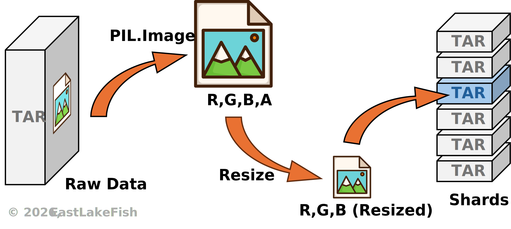

# Compressed ImageNet

::: info **This article belongs to series** [*Efficient ImageNet*](../index.md)
:::

ImageNet has been one of the standard benchmark datasets that are frequently used in computer vision tasks.
However, it is also notorious for its size - 10 million training samples, taking up approximately 140-160GB of storage.
This makes ImageNet extremely heavy for many training pipelines.

In this article, we slim down ImageNet through sharding, making it easy to distribute and suitable for DNN training.
The programs and examples are written in Python.
Due to ImageNet restrictions, a copy of the processed data will not be provided on this page.

## Overview

Sharding means to partition a large dataset into smaller chunks (e.g., tars).
Compared with reading tens of thousands of individual files, reading those chunks can be extremely fast, because each chunk is considered a single file from the filesystem perspective.

::: tip **Should chunks be as large as possible?**
Not necessarily.
Since samples are shuffled during training, a larger chunk requires a shuffling buffer that occupies more space in RAM.
A compromise between reading speed and RAM usage is using small-to-medium chunks, e.g., 1,000-10,000 images/chunk.
:::

<figure class="fig-md" style="width: 80%;">

<figcaption>
<strong>Fig. 1.</strong>
Sharding ImageNet:
Images are first resized to 224x224, and then randomly saved in shards.
This processes use multiple working threads.
</figcaption>
</figure>

## Preprocessing

The official ImageNet data are provided in tar files.
You can download these files from the official [website](https://www.image-net.org/index.php).
Take ILSVRC 2012 as example, download the following files:

|File Name|Size|MD5|
|-|-|-|
|ILSVRC2012_img_train.tar|140GB|1d675b47d978889d74fa0da5fadfb00e|
|ILSVRC2012_img_val.tar|6GB|29b22e2961454d5413ddabcf34fc5622|

Do not extract any file from those tars, but you can inspect them if you want.
In ImageNet, each category belongs to a WordNet ID (WNID), which is also used to name the directory of the corresponding images.
For example, the WNID &ldquo;n02084071&rdquo; refers to a noun (&ldquo;n&rdquo;) with an index &ldquo;02084071&rdquo;, which means &ldquo;dogs&rdquo;.
To map WNID to standard English, you can use the `nltk` library.

