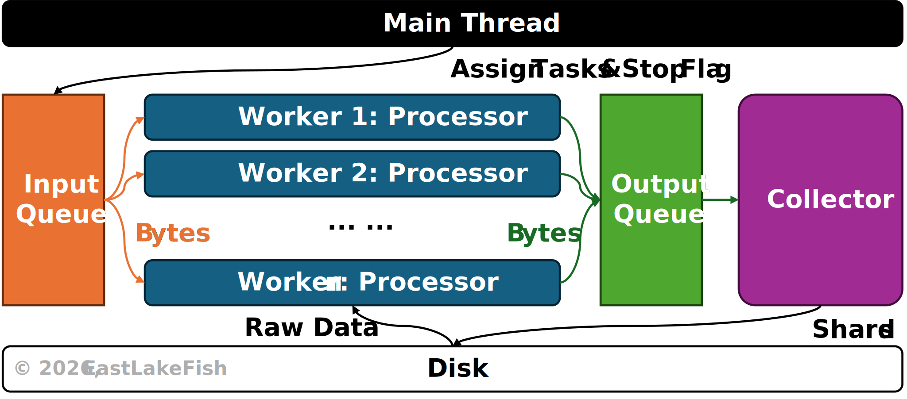

# Compressed ImageNet

::: info **This article belongs to series** [*Efficient ImageNet*](../index.md)
:::

ImageNet has been one of the standard benchmark datasets that are frequently used in computer vision tasks.
However, it is also notorious for its size - over one million training samples, taking up approximately 140-160GB of storage.
This makes ImageNet extremely heavy for many training pipelines.
In this article, we slim down ImageNet through sharding, making it easy to distribute and suitable for DNN training.
We also provide a script for global shuffling as an example of using the sharded dataset.
The programs and examples are written in Python.

The sharder code is open-source under [GNU GPL v2.0](/license) and you can download <a href="./assets/sharder.py" download>here</a>.
Due to ImageNet restrictions, a copy of the processed data will not be provided on this page.

## Sharding

Sharding means to partition a large dataset into smaller chunks (e.g., tars).
Compared with reading tens of thousands of individual files, reading those chunks can be extremely fast, because each chunk is considered a single file from the filesystem perspective.

::: tip **Should chunks be as large as possible?**
Not necessarily.
Since samples are shuffled during training, a larger chunk requires a shuffling buffer that occupies more space in RAM.
A compromise between reading speed and RAM usage is using small-to-medium chunks, e.g., 1,000-10,000 images/chunk.
:::

<figure class="fig-md" style="width: 80%;">

<figcaption>
<strong>Fig. 1.</strong>
Sharding ImageNet:
Images are first resized to 224x224, and then randomly saved in shards.
This processes use multiple working threads.
</figcaption>
</figure>

### Download

The official ImageNet data are provided in tar files.
You can download these files from the official [website](https://www.image-net.org/index.php).
Take ILSVRC 2012 as example, we need the following files:

|File Name|Size|
|-|-|
|ILSVRC2012_devkit_t12.tar.gz|2.5MB|
|ILSVRC2012_img_train.tar|140GB|
|ILSVRC2012_img_val.tar|6GB|

Do not extract any file from those tars, and just put them in the same directory.
In ImageNet, each category belongs to a WordNet ID (WNID), which is also used to name the directory of the corresponding images.
For example, the WNID &ldquo;n02084071&rdquo; refers to a noun (&ldquo;n&rdquo;) with an index &ldquo;02084071&rdquo;, which means &ldquo;dogs&rdquo;.
To map WNID to standard English, you can use the `nltk` library.

### Data Integrity

To check whether the downloaded datasets are complete, we need the `tarfile` library, which is built-in in Python (see official [docs](https://docs.python.org/3/library/tarfile.html)).
The reader, `tarfile.open`, supports `with` statement and two modes:

|Mode|Symbol|Feature|
|-|-|-|
|Random Seeking|`"r"`|Load tar structures in memory, convenient for non-sequential reading.|
|Streaming|`"r\|"`|Read bytes sequentially, low memory occupation.|

The official training split uses a nested structure, where images belonging to the same category are saved in a tar named with the corresponding WNID.
On the other hand, the tar for validation set contains unlabeled images.
To check the integrity of ImageNet, we can use the following script:

``` python
def inspect_imagenet(root: str):
    num_classes, train_samples, val_samples = 0, 0, 0
    start = time.time()

    # inspect train set
    pbar = tqdm.tqdm(total=1000, desc="Inspect train")  # requires tqdm
    with tarfile.open(os.path.join(root, "ILSVRC2012_img_train.tar"), "r") as tar_train:
        subtars = list(tar_train.getmembers())
        num_classes = len(subtars)
        for subtar in subtars:
            subtar_stream = tar_train.extractfile(subtar)
            with tarfile.open(fileobj=subtar_stream, mode="r|") as subtar:
                train_samples += len(list(subtar.getmembers()))
            pbar.update()
    
    # inspect val set
    with tarfile.open(os.path.join(root, "ILSVRC2012_img_val.tar"), "r") as tar_val:
        val_samples = len(list(tar_val.getmembers()))
    
    print(f"Classes: {num_classes} | Train: {train_samples} | Val: {val_samples} | Elapsed: {int(time.time() - start)}s.")
```

The output should match the official report:
``` text
Classes: 1000 | Train: 1281167 | Val: 50000 | Elapsed: 636s.
```

### Sharding

The ImageNet sharder employs multiple workers to shard ImageNet efficiently.
Its framework is shown in <a href="#fig:sharder">Fig. 2</a>.

<figure class="fig-md" style="width: 90%" id="fig:sharder">

<figcaption>
<strong>Fig. 2.</strong>
The framework of sharder.
It employs a main thread, a collector thread and multiple worker threads.
</figcaption>
</figure>

Once executed, the sharder will spawn multiple threads, where we run a collector and an arbitrary number of workers.
There are two types of workers.
For the training set, the main thread reads nested tars and put them in the input queue, thus workers receive bytes of those nested tars, streaming them and processing images inside them.
For validation set, the main thread loads raw image bytes, thus workers process these images directly.
The processed image bytes, along with their labels (for training set), are gathered by the collector, where they are saved to shard files.

### Benchmark

Through sharding, the ImageNet dataset can be compressed into shard files of only 14GB, while the original data take up approximately 150GB on disk, yielding a compression rate of 90%.
On HDD with I/O bandwidth 210MB/s, a sharder with 16 workers takes only 13 minutes to process the whole dataset.

## Shuffling

Many DNN optimizers value the stochasticity of samples, requiring the data to be shuffled before training.
For ImageNet, there are so many samples that shuffling becomes difficult.
For a sharded dataset, we have two approaches for shuffling:

- **Global Shuffling.** Organize image paths into a list, and shuffle the list before loading.
- **Local Shuffling.** Shuffle shards first, then shuffle images in each shard.

Local shuffling can be easier to implement, and is widely used in modern datasets such as WebDataset.
However, it doesn't yield full stochasticity and might affect convergence speed.
Recent work <a href="#qimeng2019">[1]</a> shows local shuffling can lead to a lower convergence rate.
Therefore, global shuffling is preferred when the hardware permits.

We only shuffle on the training set.
Before global shuffling, it is important to build up a database to store image information.
To achieve that, we still employ multiple workers to iterate over different shards and gather image information within those shards.
The framework to build up this database is similar to the sharder shown in <a href="#fig:sharder">Fig. 2</a>.
You can download the code <a href="./assets/shuffle.py" download>here</a>.

On SSD, the script takes approximately 30 seconds to shuffle the sharded data using a single worker, about 15 seconds with 2 workers, and about 7 seconds with 4 or more workers.

<references/>