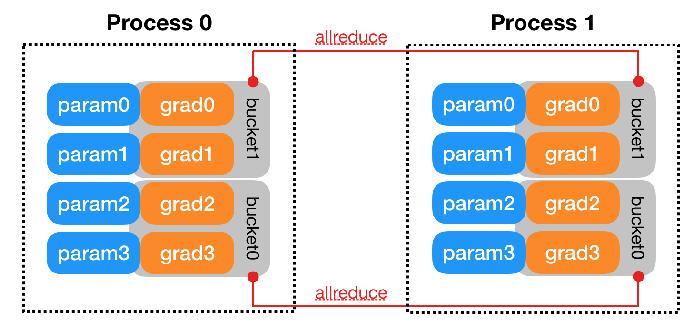
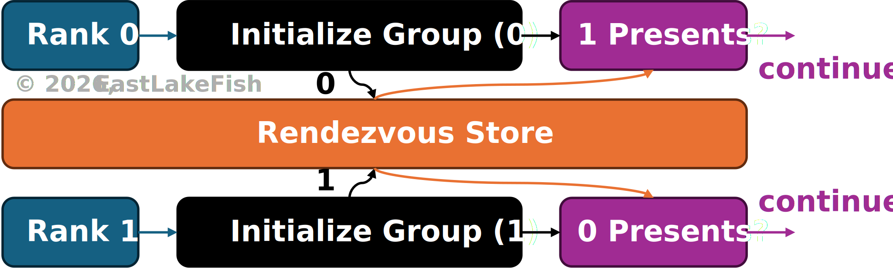
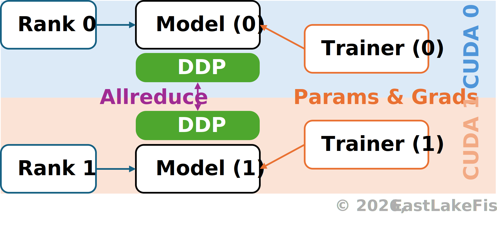

# Parallel Training with PyTorch

:::info **This article belongs to series** [*Efficient ImageNet*](/notes/machine-learning/index)
:::

Training on multiple graphics cards can be mathematically equivalent to single-card training.
It is just sometimes prohibitive due to challenges such as CPU/memory bottleneck, and the difficulty in implementing the training utilities.

An important lesson taught by the CPU bottleneck is that part of the preprocessing jobs belongs to somewhere outside the training script, especially when you plan to use two graphics cards.
Take ImageNet for example, since `DataLoader` generally does not hold old batch cache, images need to be resized at the beginning of every batch.
This leads to 1.28 million resize operations per epoch, and 128 million if you were to train for 100 epochs, while these operations are totally avoidable.

For compressing ImageNet and avoiding resizing during training, please refer to the [previous](../sharding-imagenet/index.md) note.
In this article, we will design utilities for parallel training on ImageNet with techniques brought by PyTorch Distributed Data Parallel (DDP), which is designed for synchronizing data (especially parameters and their gradients) across different processes during training.
You can find an official tutorial on DDP [here](https://docs.pytorch.org/tutorials/intermediate/ddp_tutorial.html).

## Basic Concepts

In distributed training, the number of training processes is called **world size**, and the unique identifier of each process is called a **rank**.
Comparing to concepts in operating systems, these concepts are similar to process count and process ID (PID).
The major difference between concepts in distributed training and the OS is that in distributed training, both world size and rank are fixed and are not dynamically assigned at runtime.
Intuitively, they describes processes:

``` python
processes = (Process(target=fn) for rank in range(world_size))
```

### Allreduce

In distributed systems, **reduce** refers to the process of aggregating data scattered across multiple computers or nodes into a single result, which is then synchronized to specific targets (e.g., node with some rank).

If the result is synchronized to all nodes, then we use the term **allreduce** (or *all-reduce*) instead
[<a class="source" href="https://docs.nvidia.com/doca/archive/doca-v1.3/allreduce/index.html" target="_blank">Source</a>].
Fig. 1 shows the process of synchronizing data across two processes through allreduce in PyTorch.

<figure class="fig">

<figcaption>
<strong>Fig. 1.</strong>
Synchronizing parameters and gradients across processes in PyTorch DDP.
[<a class="source" href="https://docs.pytorch.org/docs/main/notes/ddp.html" target="_blank">Source</a>]
</figcaption>
</figure>

### Process Group

In DDP, processes that are allowed to communicate with each other belong to the same **process group**.
The communication operation is implemented on a certain **backend**.
Initializing a process group in PyTorch requires three parameters `backend` `world_size` `rank`:

```python
import torch
import torch.distributed as dist

acc = torch.accelerator.current_accelerator()  # e.g., CUDA
backend = dist.get_default_backend_for_device(acc)
dist.init_process_group(backend, world_size=world_size, rank=rank)

# cleanup
dist.destroy_process_group()
```

During initialization, each training process initializes the process group and wait until all these processes finish initialization.
This is implemented by **rendezvous** mechanism (pronunciation: *ron-day-voo*), which can be regarded as allreduce before the process group is fully initialized.

<figure class="fig">

<figcaption>
<strong>Fig. 2.</strong>
Processes confirm initialization via rendezvous mechanism.
</figcaption>
</figure>

### DistributedDataParallel

As discussed earlier, DDP synchronizes model parameters and gradients through allreduce across models distributed on different processes.
This requires a special layer that handles inter-process communication and performs automatic allreduce.

<figure class="fig-md">

<figcaption>
<strong>Fig. 3.</strong>
Training with DDP.
</figcaption>
</figure>

In PyTorch, this is implemented by `torch.nn.parallel.DistributedDataParallel`:

```python
from torch import nn
from torch.nn.parallel import DistributedDataParallel as DDP

def process(rank: int):
    model = nn.Module().to(f"cuda:{rank}")
    ddp_model = DDP(model, device_ids=[rank])
```
